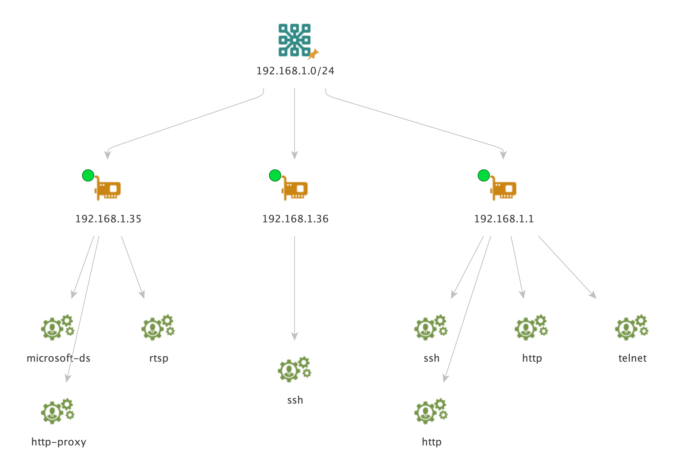

# NMAP for Maltego

Harness the power of Nmap from Maltego! This integration uses the python3-nmap package to interact with Nmap.

## How to prepare your computer to use this integration
1. Install nmap. You can download it here: https://nmap.org/. Make sure that writing "nmap" in your terminal calls the nmap software. 
2. Install the required packages: pip install -r maltego-ltc/modules/nmap/requirements.txt

## Starting Maltego with administrator privilege
To fully enjoy nmap's capabilities, you will need to run nmap as an administrator. The problem is, Maltego will execute this integration which will execute nmap. All of this means: **you have to execute Maltego as root to fully enjoy this integration.**

## Config
A config file is available at maltego-ltc/modules/nmap/config.py

You can use it to:
- Override the path to the nmap executable (default is just calling "nmap")
- Change the cache folder. This integration caches nmap's output in a folder. Default is maltego-ltc/modules/nmap/cache/ but you can modify it if needed.
- Change the number of seconds a cached file is valid. When you run a scan through this integration, nmap's output is cached and will be reused until it expires (instead of running the scan again). You can choose the number of seconds it takes for a cached file to expire.
- When running a top ports scan, nmap will scan the n most popular ports. You can change n in the config file.
- When running "Scan set of ports (-p -A)" nmap will scan a specific set of ports. You can modify this set of ports according to your needs.

## Entities
The Nmap integration uses several Entities:
- IPv4 Address (*maltego.IPv4Address*): to list open ports, services and OS running.
- Netblock CIDR (*maltego.CIDR*): to list responsive IP addresses on this netblock.
- Service (*maltego.Service*): after running certain scans, services are added to as properties to the starting Entity. You can extract them onto the graph as Service Entities by using the **Extract services** Transform.
- DNS name (*maltego.DNSName*): to list open ports, services and OS running.

## Recommendations
- Please note that certain scans might take some time to run and will not return before a few minutes have passed. This is especially true if you test all port for all the address in the netblock.
- When using netblocks, make sure you do not use the normal Maltego Netblock Entities but the CIDR version. Normal netblocks look like this "**198.51.100.0-198.51.100.255**" while CIDR ones look like this "**198.51.100.0/24**".
- Be careful when testing Nmap on Internet facing IP addresses. This might be legally dicy depending where you live. Here is a DNS name you can test without worries: **scanme.nmap.org**
- IP addresses and DNS names that responded to a scan will be labeled with a little green dot on them.

