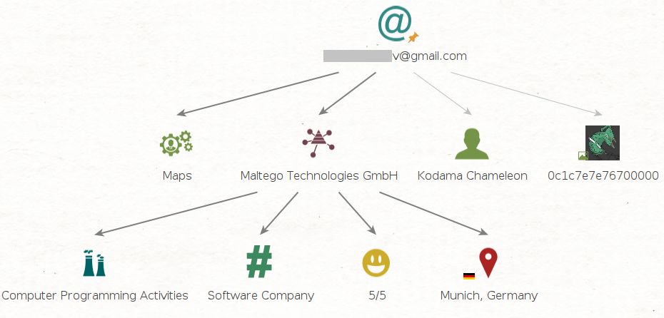
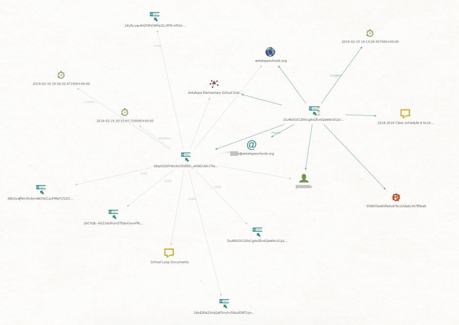

# ghunt Module

**Author:** Kodama
<br/>
**Owner:** KodamaChameleon

---

## About

Per their Github page, "[Ghunt (v2)](https://github.com/mxrch/GHunt) is an offensive Google framework, designed to evolve efficiently. 
It's currently focused on OSINT, but any use related with Google is possible." Ghunt-Maltego utilizes the Ghunt python library to create Transforms in Maltego.

Ghunt is developed by [mxrch](https://github.com/mxrch). *Ghunt-Maltego is an independent third-party utilizing the Ghunt library and not officially associated with Ghunt.*

Please use this tool ethically by respecting people's privacy and only collecting intelligence where explicit permission has been granted or otherwise legally qualified to do so. We are not responsible for any illegal use.

Must login to google, *preferably a dedicated account and not your personal or business*. Cookies are stored locally for future use. To initiate the login process use:  
```python /modules/ghunt/ghunt_login.py```

---

## Transforms

### Ghunt From Email [Ghunt]

Extracts username, profile photos, cover photos, services, and reviews from gmail address.



`maltego.EmailAddress --> maltego.Unknown`

---

### Ghunt From Drive [Ghunt]

Extract email, names, domains, organizations, modification date, creation date, child, and parent items using the URL to a google drive.



`maltego.Url --> maltego.Unknown`

---

### Ghunt From Drive [Ghunt]

Expand review details stored as dynamic properties of organization entity returned from ghuntFromEmail.

---