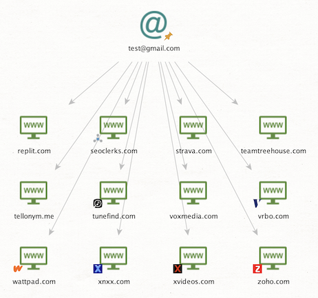

# holehe Module

**Author:** TURROKS
 
**Owner:** dw

---

## Transforms

### Email to Alias [HOLEHE]

Extracts the alias from an Email Address

Easy Helper Transform to extract the alias from an eMail Address in front of the "@"

`maltego.EmailAddress --> maltego.Alias`

---

### To Details [HOLEHE]

Returns accounts associated with an email address.
More info about HOLEHE (https://github.com/megadose/holehe)

`maltego.EmailAddress --> maltego.Website`

---